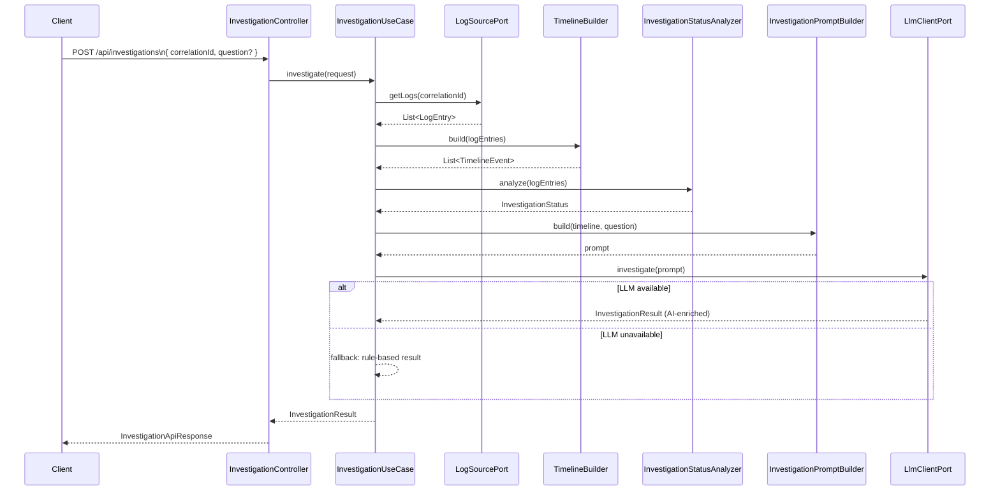

# OpenLogInvestigator

> **AI-powered log investigation for distributed systems.**
> Submit a correlation ID, get back a structured root-cause analysis — in seconds.

OpenLogInvestigator eliminates the manual grind of chasing failures across multi-service logs. It correlates raw NDJSON log streams, builds a chronological event timeline, and delegates the reasoning to an LLM — producing actionable summaries, identified failure points, and concrete recommendations through a single REST call.

---

## Key Features

- **Correlation-ID driven investigation** — filter logs from any number of services by a single trace identifier
- **AI-powered root-cause analysis** — powered by OpenAI GPT-4o-mini via Spring AI
- **Deterministic fallback** — keyword-based status analysis kicks in if the LLM is unavailable, ensuring graceful degradation
- **Structured investigation results** — every response includes status, summary, failure point, root cause, evidence list, recommendations, and a full timeline
- **Four-state investigation status** — `SUCCESSFUL`, `FAILED`, `INCONCLUSIVE`, `NO_EVIDENCE`
- **Hexagonal architecture** — domain logic is fully decoupled from infrastructure; swap the LLM provider or log source without touching business rules
- **NDJSON log format** — lightweight, streaming-friendly, one JSON object per line
- **Optional investigation question** — pass a freeform question alongside the correlation ID to direct the LLM's focus

---

## Architecture & Design

### Design Philosophy

OpenLogInvestigator is built on **Hexagonal Architecture (Ports & Adapters)**. The domain model knows nothing about HTTP, OpenAI, or file I/O. Infrastructure adapters implement domain-defined port interfaces, keeping the core invertible and independently testable.

The analysis pipeline follows a **hybrid strategy**: deterministic keyword analysis runs first to classify the transaction status, and the LLM enriches the result with narrative reasoning. This means the system remains useful even when an LLM is unavailable or rate-limited.

---

### System Flow



---

### Component Overview

```
io.github.motazco135.investigator/
├── api/                          ← HTTP layer (Controller, Request/Response DTOs)
├── domain/
│   ├── model/                    ← Immutable value objects & enums (Java records)
│   └── port/                     ← Outbound port interfaces (LogSourcePort, LlmClientPort)
├── application/
│   ├── usecase/                  ← InvestigationUseCase (workflow orchestrator)
│   └── service/                  ← TimelineBuilder, StatusAnalyzer, PromptBuilder
└── infra/
    ├── logs/                     ← JsonLinesLogSourceAdapter (NDJSON file reader)
    └── llm/                      ← OpenAiLlmAdapter (Spring AI / OpenAI integration)
```

---

## Tech Stack

| Concern | Technology |
|---|---|
| Language | Java 21 |
| Framework | Spring Boot 4.1.0 |
| AI / LLM Integration | Spring AI 2.0.0 + OpenAI GPT-4o-mini |
| Build Tool | Apache Maven |
| Log Format | JSON Lines (NDJSON) |
| Serialization | Jackson |
| Testing | JUnit 5, Mockito, AssertJ, Spring MockMvc |
| Code Generation | Project Lombok |

---

## Getting Started

### Prerequisites

| Requirement | Version |
|---|---|
| Java | 21+ |
| Maven | 3.9+ (or use the included `./mvnw` wrapper) |
| OpenAI API Key | Any valid key with GPT-4o-mini access |

> **Note:** No Docker setup is required to run locally. The application is a self-contained Spring Boot JAR.

---

### 1. Clone the repository

```bash
git clone https://github.com/motazco135/open-log-investigator.git
cd open-log-investigator
```

### 2. Set your OpenAI API key

```bash
export OPENAI_API_KEY=sk-...
```

### 3. Build the project

```bash
./mvnw clean package -DskipTests
```

### 4. Run the application

```bash
./mvnw spring-boot:run
```

The service starts on **`http://localhost:8080`** by default.

---

### 5. Invoke your first investigation

A sample NDJSON log file is bundled at `src/main/resources/sample-logs/payment-logs.ndjson`. Use `corr-123` to run an investigation against it:

```bash
curl -X POST http://localhost:8080/api/investigations \
  -H "Content-Type: application/json" \
  -d '{
    "correlationId": "corr-123",
    "question": "Why did the payment transaction fail?"
  }'
```

**Example response:**

```json
{
  "correlationId": "corr-123",
  "status": "FAILED",
  "summary": "The payment transaction failed due to a timeout in the core banking API.",
  "failurePoint": "core-banking-api",
  "rootCause": "Core banking API timeout while posting transaction",
  "evidence": [
    "Core banking API timeout while posting transaction",
    "Payment transaction failed"
  ],
  "recommendations": [
    "Investigate core banking API availability and latency.",
    "Add a circuit breaker around the core banking API call."
  ],
  "timeline": [
    { "timestamp": "2026-06-21T10:30:00Z", "service": "payment-service",  "level": "INFO",  "message": "Payment request received" },
    { "timestamp": "2026-06-21T10:30:01Z", "service": "fraud-service",    "level": "INFO",  "message": "Fraud validation approved" },
    { "timestamp": "2026-06-21T10:30:03Z", "service": "core-banking-api", "level": "ERROR", "message": "Core banking API timeout while posting transaction" },
    { "timestamp": "2026-06-21T10:30:04Z", "service": "payment-service",  "level": "ERROR", "message": "Payment transaction failed" }
  ]
}
```

---

## Configuration

All runtime properties live in `src/main/resources/application.yaml`:

```yaml
spring:
  application:
    name: open-log-investigator

  ai:
    openai:
      api-key: ${OPENAI_API_KEY}   # required — set via environment variable
      chat:
        model: gpt-4o-mini         # swap for gpt-4o or any compatible model
        temperature: 0.1           # low temperature = deterministic, fact-focused output

investigator:
  logs:
    file-path: classpath:sample-logs/payment-logs.ndjson  # point to your own NDJSON file
```

| Property | Description | Default |
|---|---|---|
| `OPENAI_API_KEY` | OpenAI API key (env var) | — |
| `spring.ai.openai.chat.model` | LLM model identifier | `gpt-4o-mini` |
| `spring.ai.openai.chat.temperature` | LLM temperature | `0.1` |
| `investigator.logs.file-path` | Path to NDJSON log file | `classpath:sample-logs/payment-logs.ndjson` |

---

## Log Format

Each line in the NDJSON source file must conform to the following structure:

```json
{
  "timestamp":     "2026-06-21T10:30:00Z",
  "correlationId": "corr-123",
  "service":       "payment-service",
  "level":         "INFO",
  "message":       "Payment request received"
}
```

| Field | Type | Required | Description |
|---|---|---|---|
| `timestamp` | ISO-8601 string | Yes | Event timestamp |
| `correlationId` | string | Yes | Trace/correlation identifier |
| `service` | string | Yes | Originating service name |
| `level` | string | Yes | Log level (`INFO`, `WARN`, `ERROR`, etc.) |
| `message` | string | Yes | Human-readable log message |


### Running Tests

```bash
# Unit tests only
./mvnw test

# Full build with integration tests
./mvnw verify
```

---


## License

This project is licensed under the **Apache License 2.0**.
See the [LICENSE](LICENSE) file for details.

---

<p align="center">
  Built with Spring Boot · Spring AI · Java 21
</p>
